# Design Document - Agent Loop v2

## Overview

This design document outlines the architecture for transforming the Receipt Tracker Agent from a single-turn fixed workflow (v1) into a multi-turn conversational system (v2) with adaptive decision-making. The system uses a supervisor agent pattern where a Main Conversation Agent orchestrates the overall conversation and delegates specialized tasks to sub-agents.

### Key Architectural Changes from v1 to v2

**v1 Architecture:**
- Single-turn: User sends image → Agent processes → Agent responds → Done
- Fixed workflow with hard-coded conditional edges
- No conversation memory or context
- Immediate processing on message receipt

**v2 Architecture:**
- Multi-turn: Ongoing conversation with context preservation
- Supervisor pattern: Main Agent + Transaction Sub-Agent
- Adaptive decision-making using LLM-based routing
- Message buffering and context injection
- Persistent conversation state with checkpointing

## Architecture

### High-Level System Architecture


```
┌─────────────────────────────────────────────────────────────────┐
│                         User Interface                          │
│                    (Telegram / Console)                         │
└────────────────────────────┬────────────────────────────────────┘
                             │
                             ↓
┌─────────────────────────────────────────────────────────────────┐
│                  Conversation Orchestrator                      │
│  • Handles context injection during processing                 │
│  • Manages agent execution state                               │
│  • Coordinates Main Agent and Sub-Agents                       │
└────────────────────────────┬────────────────────────────────────┘
                             │
                             ↓
                  ┌──────────────────────┐
                  │   Main Agent         │
                  │                      │
                  │  • Intent analysis   │
                  │  • Conversation mgmt │
                  │  • Sub-agent routing │
                  │  • Multi-turn        │
                  └──────────┬───────────┘
                             │
                             ↓
                  ┌──────────────────────┐
                  │  Transaction         │
                  │  Sub-Agent           │
                  │                      │
                  │  • Adaptive workflow │
                  │  • Field validation  │
                  │  • Dynamic decisions │
                  └──────────┬───────────┘
                             │
                             ↓
                  ┌──────────────────────────────────┐
                  │     Supabase Database            │
                  │  • Conversations                 │
                  │  • Checkpoints                   │
                  │  • Transactions                  │
                  │  • Message History               │
                  └──────────────────────────────────┘
```


## Components and Interfaces

### 1. Conversation Orchestrator

The Conversation Orchestrator manages message routing, agent execution, and context injection.

#### ConversationOrchestrator Class

```typescript
interface AgentExecutionState {
  userId: string;
  isProcessing: boolean;
  conversationId: string | null;
  startedAt: Date;
}

class ConversationOrchestrator {
  private activeExecutions: Map<string, AgentExecutionState> = new Map();
  private mainAgent: CompiledGraph; // Main conversation agent
  
  async handleMessage(
    userId: string,
    message: UserMessage
  ): Promise<void>;
  
  async injectContext(
    userId: string,
    context: string
  ): Promise<void>;
  
  private isProcessing(userId: string): boolean;
}
```

**Behavior:**
- When a message arrives, check if agent is processing for this user
- If processing: Inject context into running agent
- If not processing: Start new agent execution


### 2. Directory Structure

```
src/
├── features/
│   └── receipt-processing/
│       ├── _archive_v1/                 # OLD - Reference only, not used
│       │   ├── workflow/
│       │   │   ├── workflow.ts
│       │   │   ├── graph.ts
│       │   │   └── types.ts
│       │   └── workflow-orchestrator.ts
│       │
│       ├── main-agent/                  # NEW - Main conversation agent
│       │   ├── main-agent.ts
│       │   ├── nodes.ts
│       │   └── types.ts
│       │
│       ├── transaction-agent/           # NEW - Transaction sub-agent
│       │   ├── transaction-agent.ts
│       │   ├── nodes.ts
│       │   └── types.ts
│       │
│       └── orchestrator.ts              # NEW - Conversation orchestrator
│
├── core/
│   └── conversation/
│       └── conversation-manager.ts      # Conversation lifecycle management
```

**Note:** The `_archive_v1/` directory contains the old fixed workflow implementation for reference only. It will not be imported or used in the new system.

### 3. Main Conversation Agent

The Main Conversation Agent is a LangGraph workflow that manages the overall conversation flow.

#### ConversationState Interface

```typescript
interface ConversationState {
  // Conversation metadata
  conversationId: string;
  userId: string;
  chatId: number;
  createdAt: string;
  lastActivityAt: string;
  
  // Conversation content
  conversationHistory: ConversationMessage[];
  currentUserMessage: string; // Current message being processed
  injectedContext: string[]; // Context injected during processing
  
  // Intent and routing
  currentIntent: 'transaction' | 'general' | 'command' | null;
  activeSubAgent: string | null;
  
  // Sub-agent coordination
  subAgentState: any;
  subAgentThreadId: string | null;
  
  // Response
  responseMessage: string;
  shouldContinue: boolean;
}

interface ConversationMessage {
  role: 'user' | 'assistant';
  content: string;
  timestamp: string;
  metadata?: {
    intent?: string;
    subAgent?: string;
  };
}
```


#### Main Agent Workflow Graph

```typescript
const mainAgent = new StateGraph<ConversationState>({
  channels: {
    conversationId: null,
    userId: null,
    chatId: null,
    createdAt: null,
    lastActivityAt: null,
    conversationHistory: null,
    currentUserMessage: null,
    injectedContext: null,
    currentIntent: null,
    activeSubAgent: null,
    subAgentState: null,
    subAgentThreadId: null,
    responseMessage: null,
    shouldContinue: null,
  }
})
.addNode('analyze_intent', analyzeIntentNode)
.addNode('handle_command', handleCommandNode)
.addNode('handle_general', handleGeneralNode)
.addNode('route_to_transaction', routeToTransactionNode)
.addNode('invoke_transaction_agent', invokeTransactionAgentNode)
.addNode('update_history', updateHistoryNode)
.addNode('check_continuation', checkContinuationNode);

// Routing
mainAgent.addEdge('__start__', 'analyze_intent');

mainAgent.addConditionalEdges('analyze_intent', (state) => state.currentIntent, {
  'transaction': 'route_to_transaction',
  'general': 'handle_general',
  'command': 'handle_command',
});

mainAgent.addEdge('route_to_transaction', 'invoke_transaction_agent');
mainAgent.addEdge('invoke_transaction_agent', 'update_history');
mainAgent.addEdge('handle_general', 'update_history');
mainAgent.addEdge('handle_command', 'update_history');
mainAgent.addEdge('update_history', 'check_continuation');

mainAgent.addConditionalEdges('check_continuation', (state) => {
  return state.shouldContinue ? 'continue' : 'end';
}, {
  'continue': 'analyze_intent',
  'end': '__end__'
});
```


#### Main Agent Node Functions

**analyzeIntentNode:**
```typescript
async function analyzeIntentNode(
  state: ConversationState,
  deps: { llm: ChatOpenAI }
): Promise<Partial<ConversationState>> {
  // Combine current message with any injected context
  const allContext = [state.currentUserMessage, ...state.injectedContext].join('\n');
  
  const prompt = `
You are analyzing user intent in a financial assistant conversation.

Conversation history (last 5 messages):
${state.conversationHistory.slice(-5).map(m => `${m.role}: ${m.content}`).join('\n')}

Current user input:
${allContext}

Classify the intent as ONE of:
- transaction: User wants to process a receipt/transaction (has image or mentions transaction)
- general: General conversation, questions, or chat
- command: System commands (help, cancel, status)

Respond with ONLY the intent name.`;

  const response = await deps.llm.invoke(prompt);
  const intent = response.content.trim() as ConversationState['currentIntent'];
  
  return { 
    currentIntent: intent,
    lastActivityAt: new Date().toISOString(),
    injectedContext: [], // Clear after processing
  };
}
```

**routeToTransactionNode:**
```typescript
async function routeToTransactionNode(
  state: ConversationState
): Promise<Partial<ConversationState>> {
  // Extract image data if present in current message
  const hasImage = state.currentUserMessage.includes('[IMAGE]');
  const imageData = hasImage ? extractImageData(state.currentUserMessage) : null;
  
  // Extract text content (remove image markers)
  const textContent = state.currentUserMessage.replace(/\[IMAGE\]/g, '').trim();
  
  const subAgentThreadId = `${state.conversationId}_transaction_${Date.now()}`;
  
  return {
    activeSubAgent: 'transaction',
    subAgentThreadId,
    subAgentState: {
      conversationId: state.conversationId,
      userId: state.userId,
      chatId: state.chatId,
      imageData,
      userProvidedContext: textContent,
    }
  };
}
```


**invokeTransactionAgentNode:**
```typescript
async function invokeTransactionAgentNode(
  state: ConversationState,
  deps: { transactionAgent: CompiledGraph }
): Promise<Partial<ConversationState>> {
  const result = await deps.transactionAgent.invoke(
    state.subAgentState,
    {
      configurable: { 
        thread_id: state.subAgentThreadId 
      }
    }
  );
  
  return {
    subAgentState: result,
    responseMessage: result.responseMessage,
    activeSubAgent: result.completed ? null : 'transaction',
  };
}
```

**handleGeneralNode:**
```typescript
async function handleGeneralNode(
  state: ConversationState,
  deps: { llm: ChatOpenAI }
): Promise<Partial<ConversationState>> {
  const allContext = [state.currentUserMessage, ...state.injectedContext].join('\n');
  
  const prompt = `
You are a helpful financial assistant. Respond naturally and conversationally.

Conversation history:
${state.conversationHistory.slice(-5).map(m => `${m.role}: ${m.content}`).join('\n')}

User: ${allContext}

Provide a helpful, friendly response.`;

  const response = await deps.llm.invoke(prompt);
  
  return {
    responseMessage: response.content,
    shouldContinue: false, // End after general response
    injectedContext: [], // Clear after processing
  };
}
```

**handleCommandNode:**
```typescript
async function handleCommandNode(
  state: ConversationState
): Promise<Partial<ConversationState>> {
  const command = state.currentUserMessage.toLowerCase();
  
  if (command.includes('cancel')) {
    return {
      responseMessage: '❌ Cancelled. How else can I help you?',
      activeSubAgent: null,
      subAgentState: null,
      shouldContinue: false,
    };
  }
  
  if (command.includes('help')) {
    return {
      responseMessage: getContextualHelp(state),
      shouldContinue: false,
    };
  }
  
  if (command.includes('status')) {
    return {
      responseMessage: getConversationStatus(state),
      shouldContinue: false,
    };
  }
  
  return { responseMessage: 'Unknown command', shouldContinue: false };
}
```


### Context Injection Mechanism

When a message arrives while an agent is processing:

```typescript
class ConversationOrchestrator {
  async handleMessage(userId: string, message: UserMessage): Promise<void> {
    const execution = this.activeExecutions.get(userId);
    
    if (execution && execution.isProcessing) {
      // Agent is processing - inject context
      await this.injectContext(userId, message.content);
      return;
    }
    
    // No active processing - start new execution
    await this.startExecution(userId, message);
  }
  
  private async injectContext(userId: string, context: string): Promise<void> {
    const execution = this.activeExecutions.get(userId);
    if (!execution) return;
    
    // Load current checkpoint
    const checkpoint = await this.loadCheckpoint(execution.conversationId);
    
    // Add context to injectedContext array
    checkpoint.state.injectedContext = [
      ...(checkpoint.state.injectedContext || []),
      context
    ];
    
    // Save updated checkpoint
    await this.saveCheckpoint(execution.conversationId, checkpoint);
    
    // Agent will pick up injected context on next node execution
  }
}
```

### 4. Transaction Sub-Agent

The Transaction Sub-Agent is an adaptive LangGraph workflow that processes receipt transactions with dynamic decision-making.

#### TransactionAgentState Interface

```typescript
interface TransactionAgentState {
  // Context
  conversationId: string;
  userId: string;
  chatId: number;
  
  // Input data
  imageData: Buffer | null;
  userProvidedContext: string;
  
  // Extracted transaction data
  extractedData: Partial<ExtractedTransaction>;
  
  // Field validation
  validationStatus: {
    merchant: 'valid' | 'invalid' | 'missing';
    amount: 'valid' | 'invalid' | 'missing';
    category: 'valid' | 'invalid' | 'missing';
  };
  
  // Agent decision
  nextAction: string;
  agentReasoning: string;
  
  // Categorization
  suggestedCategories: string[];
  categoryConfidence: number;
  
  // Output
  responseMessage: string;
  transactionId: string | null;
  completed: boolean;
  
  // Error handling
  error: string | null;
  retryCount: number;
}

interface ExtractedTransaction {
  merchantName: string;
  amount: number;
  currency: string;
  dateTime: string;
  paymentMethod: string;
  transactionReference: string;
  category: string;
  confidence: number;
}
```


#### Transaction Agent Workflow Graph

```typescript
const transactionAgent = new StateGraph<TransactionAgentState>({
  channels: {
    conversationId: null,
    userId: null,
    chatId: null,
    imageData: null,
    userProvidedContext: null,
    extractedData: null,
    validationStatus: null,
    nextAction: null,
    agentReasoning: null,
    suggestedCategories: null,
    categoryConfidence: null,
    responseMessage: null,
    transactionId: null,
    completed: null,
    error: null,
    retryCount: null,
  }
})
.addNode('extract_if_needed', extractIfNeededNode)
.addNode('apply_user_context', applyUserContextNode)
.addNode('validate_fields', validateFieldsNode)
.addNode('agent_decide_action', agentDecideActionNode)
.addNode('request_merchant', requestMerchantNode)
.addNode('request_amount', requestAmountNode)
.addNode('request_category', requestCategoryNode)
.addNode('categorize', categorizeNode)
.addNode('store_transaction', storeTransactionNode)
.addNode('request_better_image', requestBetterImageNode);

// Flow
transactionAgent.addEdge('__start__', 'extract_if_needed');
transactionAgent.addEdge('extract_if_needed', 'apply_user_context');
transactionAgent.addEdge('apply_user_context', 'validate_fields');
transactionAgent.addEdge('validate_fields', 'agent_decide_action');

// Dynamic routing based on agent decision
transactionAgent.addConditionalEdges(
  'agent_decide_action',
  (state) => state.nextAction,
  {
    'request_merchant': 'request_merchant',
    'request_amount': 'request_amount',
    'request_category': 'request_category',
    'categorize': 'categorize',
    'store_transaction': 'store_transaction',
    'request_better_image': 'request_better_image',
  }
);

// Loop back to validation after user provides info
transactionAgent.addEdge('request_merchant', '__end__'); // Wait for user input
transactionAgent.addEdge('request_amount', '__end__');
transactionAgent.addEdge('request_category', '__end__');
transactionAgent.addEdge('categorize', 'validate_fields'); // Re-validate after categorization
transactionAgent.addEdge('store_transaction', '__end__'); // Complete
transactionAgent.addEdge('request_better_image', '__end__'); // Wait for new image
```


#### Transaction Agent Node Functions

**extractIfNeededNode:**
```typescript
async function extractIfNeededNode(
  state: TransactionAgentState,
  deps: { visionProcessor: VisionProcessor }
): Promise<Partial<TransactionAgentState>> {
  // Only extract if we have image data and haven't extracted yet
  if (state.imageData && !state.extractedData) {
    try {
      const extracted = await deps.visionProcessor.extractTransactionData(
        state.imageData
      );
      
      return { 
        extractedData: extracted,
        retryCount: 0,
      };
    } catch (error) {
      return {
        error: 'Failed to extract transaction data',
        extractedData: {
          merchantName: '',
          amount: 0,
          currency: 'MYR',
          dateTime: new Date().toISOString(),
          paymentMethod: 'Unknown',
          transactionReference: '',
          category: '',
          confidence: 0,
        }
      };
    }
  }
  
  // Initialize empty extracted data if no image
  if (!state.extractedData) {
    return {
      extractedData: {
        merchantName: '',
        amount: 0,
        currency: 'MYR',
        dateTime: new Date().toISOString(),
        paymentMethod: 'Unknown',
        transactionReference: '',
        category: '',
        confidence: 0,
      }
    };
  }
  
  return {};
}
```


**applyUserContextNode:**
```typescript
async function applyUserContextNode(
  state: TransactionAgentState,
  deps: { llm: ChatOpenAI }
): Promise<Partial<TransactionAgentState>> {
  if (!state.userProvidedContext || state.userProvidedContext.trim() === '') {
    return {};
  }
  
  // Use LLM to extract structured data from user context
  const prompt = `
Extract transaction details from user's message.

Current transaction data:
${JSON.stringify(state.extractedData, null, 2)}

User provided context:
"${state.userProvidedContext}"

Update the transaction data based on user's message. Only update fields that the user explicitly mentions.
Respond with JSON containing only the fields to update.

Example:
User: "This is from Starbucks"
Response: {"merchantName": "Starbucks"}

User: "The amount is 15.50"
Response: {"amount": 15.50}

User: "Starbucks coffee for 15.50"
Response: {"merchantName": "Starbucks", "amount": 15.50}`;

  const response = await deps.llm.invoke(prompt);
  const updates = JSON.parse(response.content);
  
  return {
    extractedData: {
      ...state.extractedData,
      ...updates,
    }
  };
}
```

**validateFieldsNode:**
```typescript
async function validateFieldsNode(
  state: TransactionAgentState
): Promise<Partial<TransactionAgentState>> {
  const data = state.extractedData;
  
  const validationStatus = {
    merchant: !data.merchantName || data.merchantName === '' || 
              data.merchantName === 'Unknown' || data.merchantName === 'Unknown Merchant'
      ? 'missing'
      : data.merchantName.length < 2
      ? 'invalid'
      : 'valid',
      
    amount: !data.amount || data.amount === 0
      ? 'missing'
      : data.amount < 0
      ? 'invalid'
      : 'valid',
      
    category: !data.category || data.category === ''
      ? 'missing'
      : 'valid',
  };
  
  return { validationStatus };
}
```


**agentDecideActionNode (Core Decision Logic):**
```typescript
async function agentDecideActionNode(
  state: TransactionAgentState,
  deps: { llm: ChatOpenAI }
): Promise<Partial<TransactionAgentState>> {
  const prompt = `
You are processing a transaction. Analyze the current state and decide the SINGLE next action.

Current transaction state:
- Merchant: ${state.extractedData.merchantName || 'MISSING'} (${state.validationStatus.merchant})
- Amount: ${state.extractedData.amount || 'MISSING'} (${state.validationStatus.amount})
- Category: ${state.extractedData.category || 'MISSING'} (${state.validationStatus.category})
- Extraction confidence: ${state.extractedData.confidence}

Available actions:
1. request_merchant - Ask user for merchant name
2. request_amount - Ask user for amount
3. request_category - Ask user to select category
4. categorize - Automatically categorize the transaction
5. store_transaction - Save transaction to database
6. request_better_image - Ask for clearer photo

Decision rules:
- ALWAYS prioritize merchant and amount before category (they are critical)
- If merchant is missing/invalid, choose request_merchant
- If amount is missing/invalid, choose request_amount
- If merchant and amount are valid but category is missing, choose categorize first
- Only choose store_transaction if ALL fields are valid
- Only choose request_better_image if extraction confidence < 0.3 and multiple fields are missing

Think step by step:
1. What fields are missing or invalid?
2. Which field is most critical?
3. Can I auto-categorize or do I need user input?
4. Are all fields valid enough to store?

Respond with ONLY the action name and a brief reason.
Format: ACTION_NAME | reason`;

  const response = await deps.llm.invoke(prompt);
  const [action, reasoning] = response.content.split('|').map(s => s.trim());
  
  return {
    nextAction: action,
    agentReasoning: reasoning || 'No reasoning provided',
  };
}
```


**requestMerchantNode:**
```typescript
async function requestMerchantNode(
  state: TransactionAgentState
): Promise<Partial<TransactionAgentState>> {
  let message = '🏪 I couldn\'t identify the merchant name clearly.';
  
  if (state.extractedData.amount > 0) {
    message += `\n\n💰 Amount: ${state.extractedData.currency} ${state.extractedData.amount.toFixed(2)}`;
  }
  
  message += '\n\nCould you tell me the merchant name?';
  
  return {
    responseMessage: message,
    completed: false,
  };
}
```

**requestAmountNode:**
```typescript
async function requestAmountNode(
  state: TransactionAgentState
): Promise<Partial<TransactionAgentState>> {
  let message = '💰 I couldn\'t read the amount clearly.';
  
  if (state.extractedData.merchantName) {
    message += `\n\n🏪 Merchant: ${state.extractedData.merchantName}`;
  }
  
  message += '\n\nWhat was the total amount?';
  
  return {
    responseMessage: message,
    completed: false,
  };
}
```

**requestCategoryNode:**
```typescript
async function requestCategoryNode(
  state: TransactionAgentState
): Promise<Partial<TransactionAgentState>> {
  const message = `
📁 Please select a category for this transaction:

💰 Amount: ${state.extractedData.currency} ${state.extractedData.amount.toFixed(2)}
🏪 Merchant: ${state.extractedData.merchantName}

Select from the suggested categories below:`;
  
  return {
    responseMessage: message,
    completed: false,
  };
}
```


**categorizeNode:**
```typescript
async function categorizeNode(
  state: TransactionAgentState,
  deps: { categorizer: TransactionCategorizer, config: any }
): Promise<Partial<TransactionAgentState>> {
  const result = await deps.categorizer.categorize(
    state.extractedData,
    state.userId
  );
  
  // If confidence is too low, we'll need to ask user
  if (result.confidence < deps.config.workflow.confidenceThreshold) {
    return {
      extractedData: {
        ...state.extractedData,
        category: result.category,
      },
      suggestedCategories: result.suggestedCategories || [result.category],
      categoryConfidence: result.confidence,
      nextAction: 'request_category', // Override next action
    };
  }
  
  // High confidence, accept the category
  return {
    extractedData: {
      ...state.extractedData,
      category: result.category,
    },
    categoryConfidence: result.confidence,
  };
}
```

**storeTransactionNode:**
```typescript
async function storeTransactionNode(
  state: TransactionAgentState,
  deps: { database: DatabaseClient }
): Promise<Partial<TransactionAgentState>> {
  try {
    const transactionId = await deps.database.storeTransaction({
      user_id: state.userId,
      telegram_user_id: state.userId,
      amount: state.extractedData.amount,
      currency: state.extractedData.currency,
      merchant_name: state.extractedData.merchantName,
      category: state.extractedData.category,
      date_time: state.extractedData.dateTime,
      payment_method: state.extractedData.paymentMethod,
      transaction_reference: state.extractedData.transactionReference,
      confidence_score: state.categoryConfidence,
      extraction_confidence: state.extractedData.confidence,
      processing_status: 'completed',
      awaiting_user_input: false,
      retry_count: state.retryCount,
      workflow_execution_id: state.conversationId,
    });
    
    const message = `
✅ Transaction saved!

🏪 ${state.extractedData.merchantName}
💰 ${state.extractedData.currency} ${state.extractedData.amount.toFixed(2)}
📁 ${state.extractedData.category}
🆔 ${transactionId}`;
    
    return {
      transactionId,
      responseMessage: message,
      completed: true,
    };
  } catch (error) {
    return {
      error: 'Failed to store transaction',
      responseMessage: '❌ Failed to save transaction. Please try again.',
      completed: false,
    };
  }
}
```

**requestBetterImageNode:**
```typescript
async function requestBetterImageNode(
  state: TransactionAgentState
): Promise<Partial<TransactionAgentState>> {
  const message = `
📷 The image quality is too low to extract transaction details.

💡 Tips for better results:
- Ensure good lighting
- Keep the receipt flat
- Capture the entire receipt
- Avoid shadows and glare

Please send a clearer photo.`;
  
  return {
    responseMessage: message,
    completed: false,
  };
}
```


## Data Models

### Database Schema

#### Conversations Table

```sql
CREATE TABLE conversations (
  id TEXT PRIMARY KEY,
  user_id TEXT NOT NULL,
  chat_id BIGINT NOT NULL,
  status TEXT NOT NULL CHECK (status IN ('active', 'completed', 'expired', 'cancelled')),
  created_at TIMESTAMP WITH TIME ZONE DEFAULT NOW(),
  last_activity_at TIMESTAMP WITH TIME ZONE DEFAULT NOW(),
  turn_count INTEGER DEFAULT 0,
  active_sub_agent TEXT,
  metadata JSONB,
  
  INDEX idx_conversations_user_id (user_id),
  INDEX idx_conversations_status (status),
  INDEX idx_conversations_last_activity (last_activity_at)
);
```

#### Conversation Messages Table

```sql
CREATE TABLE conversation_messages (
  id TEXT PRIMARY KEY,
  conversation_id TEXT NOT NULL REFERENCES conversations(id) ON DELETE CASCADE,
  role TEXT NOT NULL CHECK (role IN ('user', 'assistant')),
  content TEXT NOT NULL,
  timestamp TIMESTAMP WITH TIME ZONE DEFAULT NOW(),
  metadata JSONB,
  
  INDEX idx_conversation_messages_conversation_id (conversation_id),
  INDEX idx_conversation_messages_timestamp (timestamp)
);
```

#### Checkpoints Table (LangGraph)

```sql
CREATE TABLE checkpoints (
  thread_id TEXT NOT NULL,
  checkpoint_id TEXT NOT NULL,
  parent_id TEXT,
  checkpoint JSONB NOT NULL,
  metadata JSONB,
  created_at TIMESTAMP WITH TIME ZONE DEFAULT NOW(),
  
  PRIMARY KEY (thread_id, checkpoint_id),
  INDEX idx_checkpoints_thread_id (thread_id),
  INDEX idx_checkpoints_created_at (created_at)
);
```

#### Transactions Table (Extended)

```sql
-- Add conversation tracking to existing transactions table
ALTER TABLE transactions 
ADD COLUMN conversation_id TEXT,
ADD COLUMN workflow_execution_id TEXT,
ADD COLUMN turn_number INTEGER;

CREATE INDEX idx_transactions_conversation_id ON transactions(conversation_id);
```


## Error Handling

### Error Types and Recovery Strategies

#### 1. Extraction Errors
**Scenario:** Vision API fails or returns low-confidence results

**Recovery:**
- If confidence < 0.3: Request better image
- If specific fields missing: Request those fields individually
- If complete failure: Fall back to manual entry

#### 2. Categorization Errors
**Scenario:** LLM fails to categorize or returns low confidence

**Recovery:**
- Present suggested categories to user
- Allow user to select or provide custom category
- Learn from user's selection for future

#### 3. Storage Errors
**Scenario:** Database operation fails

**Recovery:**
- Retry up to 3 times with exponential backoff
- Preserve transaction data in conversation state
- Notify user and offer to retry later

#### 4. Context Injection Errors
**Scenario:** Message arrives while agent is in invalid state

**Recovery:**
- Queue message for next turn
- Log warning for debugging
- Continue processing current turn

#### 5. Checkpoint Errors
**Scenario:** Failed to save or load checkpoint

**Recovery:**
- Attempt to reconstruct state from database
- If reconstruction fails, start fresh conversation
- Notify user of data loss

### Error Logging

All errors should be logged with:
- Conversation ID
- User ID
- Error type and message
- Current state snapshot
- Stack trace
- Timestamp


## Testing Strategy

### Unit Tests

#### Orchestrator Tests
- Test context injection during processing
- Test concurrent message handling
- Test agent execution state tracking

#### Main Agent Tests
- Test intent classification accuracy
- Test routing to correct sub-agent
- Test conversation history management
- Test command handling
- Test conversation lifecycle

#### Transaction Sub-Agent Tests
- Test field validation logic
- Test agent decision-making with various states
- Test extraction with/without image
- Test user context application
- Test categorization flow
- Test transaction storage

### Integration Tests

#### End-to-End Conversation Flows
- Happy path: Image → Extract → Categorize → Store
- Clarification path: Image → Extract → Request merchant → Store
- Multi-turn path: Image → Text context → Extract → Store
- Error recovery: Bad image → Request better → Success
- Command interruption: Processing → Cancel → Restart

#### Checkpoint Persistence Tests
- Test state save after each turn
- Test state restoration on resume
- Test checkpoint cleanup after expiration
- Test concurrent conversation handling

### Performance Tests

#### Latency Benchmarks
- Intent analysis: < 2 seconds
- Transaction extraction: < 5 seconds
- Agent decision: < 2 seconds
- End-to-end transaction: < 15 seconds

#### Load Tests
- Concurrent conversations: 100+ users
- Message throughput: 1000+ messages/minute
- Checkpoint storage: 10,000+ checkpoints
- Database queries: < 100ms p95


## Implementation Phases

### Phase 1: Foundation (Core Infrastructure)
- Move existing workflow to _archive_v1/ directory
- Set up PostgreSQL checkpointing
- Create conversation and message tables
- Implement Conversation Orchestrator
- Implement basic Main Agent structure
- Add conversation lifecycle management

### Phase 2: Transaction Sub-Agent (Adaptive Workflow)
- Implement Transaction Agent state and nodes
- Add field validation logic
- Implement agent decision node with LLM
- Add dynamic routing based on decisions
- Integrate with existing vision and categorization services

### Phase 3: Context Injection (Multi-Turn Support)
- Implement context injection during processing
- Add user context application node
- Test sequential message handling
- Add support for resuming from checkpoints

### Phase 4: Integration and Polish
- Integrate with messaging adapters (Telegram, Console)
- Add command handling (cancel, help, status)
- Implement conversation expiration
- Add comprehensive error handling
- Performance optimization

### Phase 5: Testing and Deployment
- Write unit and integration tests
- Conduct end-to-end testing
- Performance and load testing
- Documentation
- Deploy and monitor


## Configuration

### Environment Variables

```typescript
interface AgentLoopConfig {
  // Conversation management
  conversationExpirationHours: number; // default: 24
  maxConversationHistory: number; // default: 20
  
  // Agent decision-making
  categoryConfidenceThreshold: number; // default: 0.8
  extractionConfidenceThreshold: number; // default: 0.3
  
  // Retry and timeout
  maxRetries: number; // default: 3
  retryDelayMs: number; // default: 2000
  agentDecisionTimeoutMs: number; // default: 30000
  
  // LLM configuration
  llmModel: string; // default: 'gpt-4o-mini'
  llmTemperature: number; // default: 0.7
  llmMaxTokens: number; // default: 500
  
  // Database
  checkpointCleanupIntervalHours: number; // default: 6
  
  // Feature flags
  enableContextInjection: boolean; // default: true
  enableAdaptiveDecisions: boolean; // default: true
}
```

### Default Configuration

```typescript
export const defaultConfig: AgentLoopConfig = {
  conversationExpirationHours: 24,
  maxConversationHistory: 20,
  categoryConfidenceThreshold: 0.8,
  extractionConfidenceThreshold: 0.3,
  maxRetries: 3,
  retryDelayMs: 2000,
  agentDecisionTimeoutMs: 30000,
  llmModel: 'gpt-4o-mini',
  llmTemperature: 0.7,
  llmMaxTokens: 500,
  checkpointCleanupIntervalHours: 6,
  enableContextInjection: true,
  enableAdaptiveDecisions: true,
};
```


## Migration from v1 to v2

### Complete Replacement Strategy

v2 completely replaces v1 - no backward compatibility or gradual rollout:

1. **Archive v1:** Move existing workflow code to `_archive_v1/` directory
2. **Implement v2:** Build new agent loop system from scratch
3. **Database Migration:** Add new tables (conversations, checkpoints, messages)
4. **Deploy:** Replace v1 with v2 in single deployment
5. **Monitor:** Track metrics post-deployment

### Migration Steps

1. Move `src/features/receipt-processing/workflow/` → `src/features/receipt-processing/_archive_v1/workflow/`
2. Move `src/features/receipt-processing/workflow-orchestrator.ts` → `src/features/receipt-processing/_archive_v1/`
3. Run database migrations (add conversations, checkpoints, messages tables)
4. Implement v2 components (main-agent, transaction-agent, orchestrator)
5. Update index.ts to use new orchestrator
6. Deploy and monitor

### Metrics to Monitor Post-Migration

- Conversation completion rate
- Average turns per conversation
- User satisfaction (implicit: completion without cancel)
- Error rates by type
- Latency percentiles (compare to v1 baseline)
- LLM token usage and costs
- Checkpoint storage growth


## Sequence Diagrams

### Happy Path: Single Image


### Multi-Turn Clarification Path

```mermaid
sequenceDiagram
    participant U as User
    participant CO as Orchestrator
    participant MA as Main Agent
    participant TA as Transaction Agent
    participant DB as Database
    
    U->>CO: Send blurry image
    CO->>MA: Start execution
    MA->>MA: Analyze intent → transaction
    MA->>TA: Invoke with image
    TA->>TA: Extract (low confidence)
    TA->>TA: Validate → merchant missing
    TA->>TA: Agent decides → request_merchant
    TA-->>MA: Wait for input
    MA-->>U: "🏪 What's the merchant name?"
    
    U->>CO: "Starbucks"
    CO->>MA: Resume execution
    MA->>MA: Analyze intent → transaction
    MA->>TA: Resume with context
    TA->>TA: Apply context → merchant=Starbucks
    TA->>TA: Validate → all valid
    TA->>TA: Agent decides → categorize
    TA->>TA: Categorize
    TA->>TA: Agent decides → store
    TA->>DB: Store transaction
    TA-->>MA: Complete
    MA-->>U: "✅ Transaction saved!"
```



### Context Injection During Processing


## Key Design Decisions

### 1. Why Supervisor Pattern?

**Decision:** Use Main Agent + Sub-Agents instead of single monolithic agent

**Rationale:**
- Clear separation of concerns (conversation vs task execution)
- Easier to add new sub-agents in future (analytics, reports)
- Sub-agents can be tested independently
- Better state isolation and checkpoint management
- Allows different LLM models/configs per agent

### 2. Why Context Injection Instead of Buffering?

**Decision:** Inject context into running agent instead of buffering messages

**Rationale:**
- No artificial delay - immediate processing
- Simpler implementation
- Works for any timing (immediate or delayed)
- Agent processes context at next decision point
- More responsive user experience

**How it works:**
- Message arrives → Check if agent is processing
- If processing → Add to injectedContext in checkpoint
- Agent reads injectedContext at next node execution
- Context is incorporated into decision-making

### 3. Why LLM-Based Decision Node?

**Decision:** Use LLM to decide next action instead of hard-coded logic

**Rationale:**
- More flexible and adaptive to edge cases
- Can reason about complex state combinations
- Easier to modify behavior via prompt engineering
- Handles unexpected scenarios gracefully
- Reduces code complexity and maintenance

**Trade-offs:**
- Additional LLM API call per decision (cost + latency)
- Less predictable than hard-coded logic
- Requires careful prompt engineering
- Potential for unexpected decisions

**Mitigation:**
- Use fast, cheap model (gpt-4o-mini) for decisions
- Implement decision logging for debugging
- Add guardrails in conditional routing
- Monitor decision quality metrics

### 4. Why PostgreSQL Checkpointing?

**Decision:** Use LangGraph's PostgreSQL checkpointer instead of in-memory

**Rationale:**
- Persistent state survives restarts
- Enables conversation resumption
- Supports time-travel debugging
- Already have Supabase (PostgreSQL)
- Native LangGraph feature

### 5. Why Separate Thread IDs for Sub-Agents?

**Decision:** Use `${conversationId}_transaction_${timestamp}` for sub-agent threads

**Rationale:**
- Isolates sub-agent state from main conversation
- Allows multiple sub-agent invocations per conversation
- Easier to debug specific sub-agent executions
- Prevents state pollution between agents

### 6. Why Archive v1 Instead of Deleting?

**Decision:** Move v1 to `_archive_v1/` directory instead of deleting

**Rationale:**
- Preserve reference implementation for comparison
- Easy to review old logic if questions arise
- Can extract useful patterns or code snippets
- Helps with debugging if issues found post-migration
- Clear signal (underscore prefix) that it's archived
- Can be safely deleted after v2 is stable (e.g., 3 months)


## Security Considerations

### Input Validation

- Sanitize all user text inputs before processing
- Validate image file types and sizes
- Limit message buffer size to prevent memory exhaustion
- Rate limit messages per user (e.g., 10 messages/minute)

### Data Privacy

- Store conversation data with user consent
- Implement conversation data retention policy (delete after 30 days)
- Encrypt sensitive data in checkpoints
- Anonymize data in logs and metrics

### Access Control

- Verify user identity before loading conversation state
- Prevent users from accessing other users' conversations
- Implement conversation ownership checks
- Secure database access with proper credentials

### Prompt Injection Protection

- Sanitize user input before including in LLM prompts
- Use system messages to establish boundaries
- Validate LLM responses before executing actions
- Implement output filtering for sensitive data

## Monitoring and Observability

### Key Metrics

**Conversation Metrics:**
- Active conversations count
- Average conversation duration
- Conversation completion rate
- Turns per conversation (avg, p50, p95)

**Performance Metrics:**
- Message buffer latency
- Intent analysis latency
- Sub-agent invocation latency
- End-to-end transaction time
- Checkpoint save/load time

**Quality Metrics:**
- Agent decision accuracy
- Field validation accuracy
- Categorization accuracy
- User correction rate

**Cost Metrics:**
- LLM API calls per conversation
- Token usage per conversation
- Database storage growth
- Checkpoint storage size

### Logging

All operations should log:
- Conversation ID
- User ID
- Operation type
- Timestamp
- Duration
- Success/failure
- Error details (if applicable)

### Alerting

Set up alerts for:
- High error rates (> 5%)
- High latency (p95 > 30s)
- Checkpoint failures
- Database connection issues
- LLM API failures
- Conversation expiration backlog

