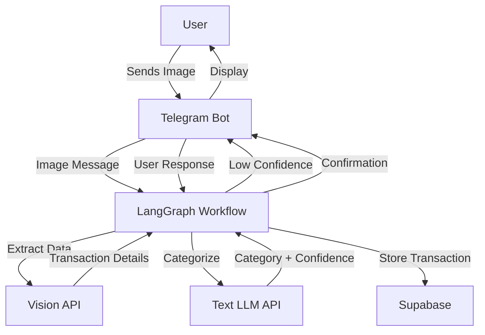
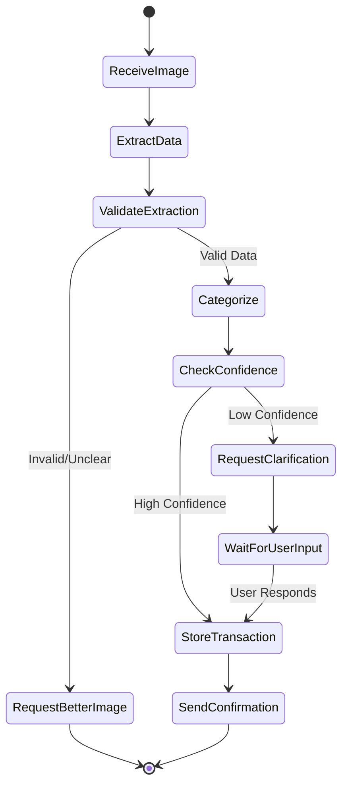

# Design Document

## Overview

The Receipt Tracker Agent is a Node.js/TypeScript-based system that combines Telegram bot functionality with LangChain/LangGraph orchestration to process receipt and e-wallet transaction images. The system uses vision AI to extract transaction data, intelligently categorizes spending, and stores results in Supabase. When categorization confidence is low, it engages users through Telegram for clarification.

### Key Technologies
- **LangChain.js**: Framework for LLM application development, handling prompts and API interactions
- **LangGraph.js**: State machine orchestration for complex agent workflows
- **node-telegram-bot-api** or **telegraf**: Telegram Bot API wrapper for message handling
- **@supabase/supabase-js**: Database operations and storage
- **OpenAI-compatible API**: Vision and text completion endpoints
- **sharp**: Image processing and optimization
- **TypeScript**: Type-safe development

## Architecture

### High-Level Architecture



### System Components

1. **Telegram Bot Handler**: Entry point for user interactions
2. **LangGraph State Machine**: Orchestrates the processing workflow
3. **Vision Processor**: Extracts transaction data from images
4. **Categorization Engine**: Classifies transactions with confidence scoring
5. **Supabase Client**: Handles data persistence
6. **Configuration Manager**: Manages environment and application settings

### LangGraph State Machine



## Components and Interfaces

### 1. Telegram Bot Handler (`telegram-bot.ts`)

**Responsibilities:**
- Initialize and run Telegram bot
- Handle incoming messages and commands
- Send messages and interactive keyboards to users
- Manage conversation state with users

**Key Methods:**
```typescript
class TelegramBotHandler {
    async startCommand(ctx: Context): Promise<void>
    async helpCommand(ctx: Context): Promise<void>
    async handlePhoto(ctx: Context): Promise<void>
    async handleCallbackQuery(ctx: Context): Promise<void>
    async sendCategoryOptions(chatId: number, transactionData: any, categories: string[]): Promise<void>
    async sendConfirmation(chatId: number, transaction: Transaction): Promise<void>
}
```

**Interfaces:**
- Input: Telegram Context objects (messages, callbacks)
- Output: Triggers LangGraph workflow, sends Telegram messages

### 2. LangGraph Workflow (`workflow.ts`)

**Responsibilities:**
- Define and execute the state machine
- Manage workflow state across nodes
- Handle transitions and conditional routing
- Coordinate between components

**State Schema:**
```typescript
interface WorkflowState {
    telegramUserId: string;
    chatId: number;
    imageUrl?: string;
    imageData?: Buffer;
    extractedData?: ExtractedTransaction;
    category?: string;
    confidence?: number;
    transactionId?: string;
    error?: string;
    awaitingUserInput: boolean;
}
```

**Node Functions:**
```typescript
async function receiveImageNode(state: WorkflowState): Promise<Partial<WorkflowState>>
async function extractDataNode(state: WorkflowState): Promise<Partial<WorkflowState>>
async function categorizeNode(state: WorkflowState): Promise<Partial<WorkflowState>>
async function requestClarificationNode(state: WorkflowState): Promise<Partial<WorkflowState>>
async function storeTransactionNode(state: WorkflowState): Promise<Partial<WorkflowState>>
async function sendConfirmationNode(state: WorkflowState): Promise<Partial<WorkflowState>>
```

**Conditional Edges:**
```typescript
function shouldRequestClarification(state: WorkflowState): string {
    // Returns "clarify" if confidence < threshold, else "store"
}
    
function isExtractionValid(state: WorkflowState): string {
    // Returns "valid" or "invalid"
}
```

### 3. Vision Processor (`vision-processor.ts`)

**Responsibilities:**
- Prepare images for API submission
- Call OpenAI-compatible vision API
- Parse and structure extracted transaction data
- Handle API errors and retries

**Key Methods:**
```typescript
class VisionProcessor {
    constructor(apiKey: string, apiBase: string)
    async extractTransactionData(imageData: Buffer): Promise<ExtractedTransaction>
    private buildVisionPrompt(): string
    private parseResponse(response: string): ExtractedTransaction
}
```

**Extraction Output Schema:**
```typescript
interface ExtractedTransaction {
    amount: number;
    currency: string;
    merchantName: string;
    dateTime: string;  // ISO format
    paymentMethod: string;
    transactionReference?: string;
    items?: Array<{name: string; price: number; quantity: number}>;
    confidence: number;  // Extraction confidence
}
```

### 4. Categorization Engine (`categorizer.ts`)

**Responsibilities:**
- Classify transactions into spending categories
- Calculate confidence scores
- Learn from user corrections
- Suggest categories based on history

**Key Methods:**
```typescript
class TransactionCategorizer {
    constructor(llmClient: any, supabaseClient: SupabaseClient)
    async categorize(transactionData: ExtractedTransaction, userId: string): Promise<{category: string, confidence: number}>
    async getSimilarTransactions(merchantName: string, userId: string): Promise<Transaction[]>
    async suggestCategories(transactionData: ExtractedTransaction): Promise<string[]>
    private buildCategorizationPrompt(transactionData: ExtractedTransaction, history: Transaction[]): string
}
```

**Category Definitions:**
```typescript
const CATEGORIES = [
    "Food & Dining",
    "Transportation",
    "Shopping",
    "Entertainment",
    "Bills & Utilities",
    "Healthcare",
    "Groceries",
    "Personal Care",
    "Education",
    "Travel & Vacation",
    "Tech Gadgets",
    "Subscriptions",
    "Others"
] as const;

type Category = typeof CATEGORIES[number];
```

**Confidence Threshold:**
- High confidence: >= 0.8 (auto-assign)
- Medium confidence: 0.5-0.8 (suggest with options)
- Low confidence: < 0.5 (ask user with all categories)

### 5. Supabase Client (`database.ts`)

**Responsibilities:**
- Initialize Supabase connection
- CRUD operations for transactions
- Query transaction history
- Store user preferences and learning data

**Key Methods:**
```typescript
class DatabaseClient {
    constructor(supabaseUrl: string, supabaseKey: string)
    async storeTransaction(transaction: Transaction): Promise<string>
    async getUserTransactions(userId: string, limit: number): Promise<Transaction[]>
    async getSimilarTransactions(merchantName: string, userId: string): Promise<Transaction[]>
    async updateTransactionCategory(transactionId: string, category: string): Promise<void>
    async getSpendingStats(userId: string, period: string): Promise<SpendingStats>
}
```

### 6. Configuration Manager (`config.ts`)

**Responsibilities:**
- Load environment variables
- Validate configuration
- Provide typed configuration access
- Handle defaults

**Configuration Schema:**
```typescript
interface Config {
    // Telegram
    telegramBotToken: string;
    
    // OpenAI-compatible API
    openaiApiKey: string;
    openaiApiBase: string;
    visionModel: string;  // default: "gpt-4-vision-preview"
    textModel: string;    // default: "gpt-4"
    
    // Supabase
    supabaseUrl: string;
    supabaseKey: string;
    
    // Application Settings
    confidenceThreshold: number;  // default: 0.8
    maxRetries: number;           // default: 3
    retryDelay: number;           // default: 2000 (ms)
    logLevel: string;             // default: "info"
}
```

## Data Models

### Supabase Schema

**Table: transactions**
```sql
CREATE TABLE transactions (
    id UUID PRIMARY KEY DEFAULT uuid_generate_v4(),
    user_id TEXT NOT NULL,
    telegram_user_id TEXT NOT NULL,
    amount DECIMAL(10, 2) NOT NULL,
    currency TEXT NOT NULL DEFAULT 'MYR',
    merchant_name TEXT NOT NULL,
    category TEXT NOT NULL,
    date_time TIMESTAMP WITH TIME ZONE NOT NULL,
    payment_method TEXT,
    transaction_reference TEXT,
    image_url TEXT,
    raw_extracted_data JSONB,
    confidence_score DECIMAL(3, 2),
    user_corrected BOOLEAN DEFAULT FALSE,
    created_at TIMESTAMP WITH TIME ZONE DEFAULT NOW(),
    updated_at TIMESTAMP WITH TIME ZONE DEFAULT NOW()
);

CREATE INDEX idx_transactions_user_id ON transactions(user_id);
CREATE INDEX idx_transactions_telegram_user_id ON transactions(telegram_user_id);
CREATE INDEX idx_transactions_merchant_name ON transactions(merchant_name);
CREATE INDEX idx_transactions_category ON transactions(category);
CREATE INDEX idx_transactions_date_time ON transactions(date_time DESC);
```

**Table: user_preferences**
```sql
CREATE TABLE user_preferences (
    id UUID PRIMARY KEY DEFAULT uuid_generate_v4(),
    telegram_user_id TEXT UNIQUE NOT NULL,
    default_currency TEXT DEFAULT 'MYR',
    timezone TEXT DEFAULT 'Asia/Kuala_Lumpur',
    created_at TIMESTAMP WITH TIME ZONE DEFAULT NOW(),
    updated_at TIMESTAMP WITH TIME ZONE DEFAULT NOW()
);
```

**Table: category_learning**
```sql
CREATE TABLE category_learning (
    id UUID PRIMARY KEY DEFAULT uuid_generate_v4(),
    user_id TEXT NOT NULL,
    merchant_name TEXT NOT NULL,
    category TEXT NOT NULL,
    frequency INT DEFAULT 1,
    last_used TIMESTAMP WITH TIME ZONE DEFAULT NOW(),
    UNIQUE(user_id, merchant_name, category)
);

CREATE INDEX idx_category_learning_user_merchant ON category_learning(user_id, merchant_name);
```

## Error Handling

### Error Categories and Responses

1. **Image Processing Errors**
   - Unreadable image: Request clearer photo
   - Unsupported format: Notify user of supported formats
   - Image too large: Compress and retry

2. **API Errors**
   - Rate limit: Exponential backoff with user notification
   - Authentication failure: Log error, notify admin
   - Timeout: Retry with increased timeout

3. **Database Errors**
   - Connection failure: Retry with backoff
   - Constraint violation: Log and notify user
   - Query timeout: Optimize query or notify user

4. **Workflow Errors**
   - Invalid state transition: Log and reset workflow
   - Missing required data: Request from user
   - Timeout waiting for user: Send reminder or cancel

### Error Recovery Strategy

```typescript
class ErrorHandler {
    async handleError(error: Error, state: WorkflowState): Promise<Partial<WorkflowState>> {
        if (error instanceof APIError) {
            return await this.handleApiError(error, state);
        } else if (error instanceof DatabaseError) {
            return await this.handleDatabaseError(error, state);
        } else {
            return await this.handleGenericError(error, state);
        }
    }
    
    private async handleApiError(error: APIError, state: WorkflowState): Promise<Partial<WorkflowState>> {
        // Implement retry logic with exponential backoff
    }
        
    private async handleDatabaseError(error: DatabaseError, state: WorkflowState): Promise<Partial<WorkflowState>> {
        // Queue for retry, notify user if critical
    }
}
```

## Testing Strategy

### Unit Tests

**Vision Processor Tests:**
- Test extraction with various receipt formats
- Test error handling for invalid images
- Mock API responses for consistent testing
- Validate output schema compliance

**Categorization Engine Tests:**
- Test category assignment with known merchants
- Test confidence scoring accuracy
- Test learning from user corrections
- Test suggestion generation

**Database Client Tests:**
- Test CRUD operations
- Test query performance with large datasets
- Test connection error handling
- Test transaction rollback scenarios

### Integration Tests

**Workflow Tests:**
- Test complete happy path (image → storage → confirmation)
- Test clarification flow (low confidence → user input → storage)
- Test error recovery paths
- Test state persistence across interruptions

**Telegram Bot Tests:**
- Test message handling with mock updates
- Test callback query processing
- Test command execution
- Test concurrent user handling

### End-to-End Tests

**Scenario Tests:**
- Submit e-wallet screenshot → verify correct extraction and storage
- Submit physical receipt → verify itemization
- Submit ambiguous transaction → verify clarification request
- Test /stats command → verify accurate calculations

### Test Data

- Sample e-wallet screenshots (DuitNow, GrabPay, Touch 'n Go, etc.)
- Sample physical receipts (restaurants, retail, services)
- Edge cases (blurry images, partial receipts, foreign currency)

### Testing Tools

- **Jest**: Test framework
- **ts-jest**: TypeScript support for Jest
- **@types/jest**: TypeScript type definitions
- **telegraf test utilities**: Bot testing helpers
- **Supabase test client**: Database testing
- **nock**: HTTP mocking for API tests

## Deployment Considerations

### Environment Setup

```bash
# Required environment variables
TELEGRAM_BOT_TOKEN=<token>
OPENAI_API_KEY=<key>
OPENAI_API_BASE=<endpoint>
SUPABASE_URL=<url>
SUPABASE_KEY=<key>

# Optional configuration
CONFIDENCE_THRESHOLD=0.8
LOG_LEVEL=info
MAX_RETRIES=3
NODE_ENV=production
```

### Deployment Options

1. **Cloud VM (Recommended for MVP)**
   - Deploy on DigitalOcean, AWS EC2, or similar
   - Use PM2 for process management
   - Nginx reverse proxy if needed
   - Automated backups for Supabase

2. **Container Deployment**
   - Docker container with Node.js runtime
   - Docker Compose for local development
   - Kubernetes for production scaling

3. **Serverless (Future Consideration)**
   - AWS Lambda with API Gateway
   - Vercel or Netlify Functions
   - Requires webhook mode for Telegram
   - Cold start considerations

### Monitoring and Logging

- **Logging**: Structured logging with winston or pino
- **Metrics**: Track processing time, API calls, error rates
- **Alerts**: Set up alerts for critical errors (API failures, database issues)
- **Health Checks**: Endpoint for monitoring bot status

### Security Considerations

- Store API keys and tokens in environment variables, never in code
- Use Supabase Row Level Security (RLS) policies
- Validate and sanitize all user inputs
- Implement rate limiting to prevent abuse
- Use HTTPS for all external API calls
- Regularly rotate API keys and tokens

## Performance Optimization

### Image Processing
- Compress images before sending to API (max 2MB)
- Cache processed results to avoid reprocessing
- Implement request queuing for high load

### Database Queries
- Use indexes on frequently queried columns
- Implement pagination for large result sets
- Cache frequently accessed data (user preferences)

### API Usage
- Batch requests when possible
- Implement request caching for similar queries
- Use streaming responses for large data

## Future Enhancements

1. **Multi-language Support**: Detect and process receipts in multiple languages
2. **Budget Tracking**: Alert users when approaching budget limits
3. **Recurring Transaction Detection**: Identify and track subscriptions
4. **Export Functionality**: Generate spending reports in CSV/PDF
5. **Voice Input**: Process voice messages describing transactions
6. **Web Dashboard**: Provide web interface for detailed analytics
7. **Split Transactions**: Support splitting bills among multiple people
8. **Receipt OCR Improvements**: Fine-tune model on local receipt formats
